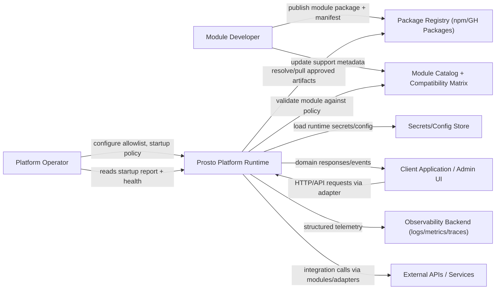

# C4-01 System Context

Date: 2026-03-24  
Scope: L1 context view

## Purpose
Define how `prosto-platform` interacts with primary actors and external systems.

## Context Diagram

## External Actors And Responsibilities

| Actor/System | Responsibility |
|---|---|
| Platform Operator | Configures runtime policy, module allowlist, and deployment settings |
| Module Developer | Builds and publishes compatible modules |
| Client Application | Sends API requests and consumes responses |
| Package Registry | Hosts module artifacts for distribution |
| Module Catalog | Stores compatibility, support, and security review status |
| Secrets/Config Store | Provides sensitive runtime configuration |
| Observability Backend | Receives logs, metrics, traces |
| External APIs | Integrated systems consumed by modules/adapters |

## Key Context-Level Policies
- Runtime does not load arbitrary modules outside explicit allowlist.
- Module artifacts must include compatibility metadata.
- Kernel remains framework-neutral; transport is adapter-owned.

## Linked Views
- Containers: [C4-02 Container View](./02-container-view.md)
- Loading data flow: [DFD-03 Module Loading L2](../dfd/03-module-loading-l2.md)
- Governance decisions: [ADR-0003](../adr/ADR-0003-module-loading-security-allowlist-integrity.md), [ADR-0006](../adr/ADR-0006-external-module-repository-and-distribution-model.md)

