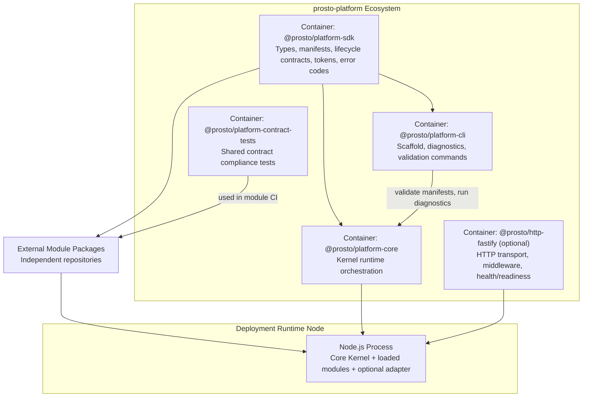

# C4-02 Container View

Date: 2026-03-24  
Scope: L2 container view

## Purpose
Describe major runtime/development containers and their responsibilities.

## Container Diagram

## Container Responsibilities

| Container | Responsibilities | Must Not Own |
|---|---|---|
| `@prosto/platform-sdk` | Shared contracts, types, token model, error taxonomy | Runtime side effects, framework code |
| `@prosto/platform-core` | Bootstrapping, loading, compatibility, lifecycle orchestration, registry/event bus | HTTP framework specifics, ORM specifics, domain modules |
| `@prosto/platform-cli` | Scaffolding, preflight checks, config/module diagnostics | Runtime hosting logic |
| `@prosto/http-fastify` (optional) | Request routing, middleware, auth hooks, health surfaces | Kernel lifecycle ownership |
| External Modules | Feature and integration logic, capability implementations | Kernel orchestration concerns |
| Contract Test Package | Contract conformance suite reusable in CI | Production runtime behavior |

## Data Stores And External Dependencies
- Config source: env/files/secret provider.
- Package source: npm or GitHub Packages.
- Observability sink: logging and metrics backend.
- Module catalog: compatibility + support metadata.

## Container Interaction Rules
- Core imports SDK contracts, never the opposite.
- Modules depend on SDK (peer dependency), not on core internals.
- Adapter depends on SDK and core extension points.
- Contract tests depend on SDK contract fixtures and target core compatibility matrix.

## Linked Views
- Components in core: [C4-03 Core Component View](./03-component-view-kernel.md)
- Runtime data flow: [DFD-02 Runtime L1](../dfd/02-runtime-l1.md)
- Stack decision: [ADR-0005](../adr/ADR-0005-core-runtime-stack-validation-and-logging.md)

