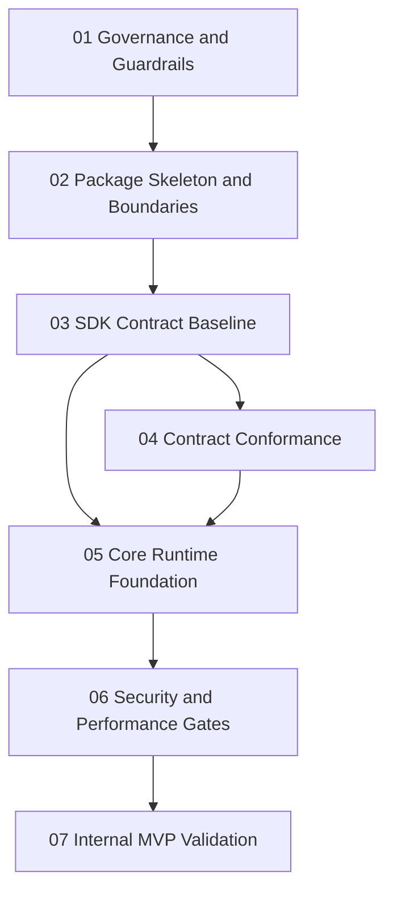

# Implementation Plan Index

This index consolidates the execution-ready implementation plan for `prosto-platform` based on the current repository state and architecture artifacts in `.context/02-architecture-design` and `.context/03-work-plan`.

## Planning Baseline
- Repository currently has architecture and planning artifacts but no production runtime implementation.
- Architecture intent emphasizes micro-core boundaries, contract-first delivery, deterministic lifecycle, and security-first module loading.
- This plan is sequenced to reduce early architecture drift and keep risk controls enforceable from the first implementation increment.

## Phase Order
1. [Phase 01 - Governance Activation and Delivery Guardrails](./01-phase.md)
2. [Phase 02 - Monorepo Package Skeleton and Contract Surface Setup](./02-phase.md)
3. [Phase 03 - SDK Contract Baseline and Manifest Validation](./03-phase.md)
4. [Phase 04 - Contract Conformance Test Package and Reference Module Validation](./04-phase.md)
5. [Phase 05 - Core Runtime Foundation and Deterministic Lifecycle](./05-phase.md)
6. [Phase 06 - Security Controls and Performance Regression Gates](./06-phase.md)
7. [Phase 07 - Internal MVP Validation and Operability Readiness](./07-phase.md)

## Phase Summaries
### 01
Converts architecture governance from documentation into mandatory CI and branch protection controls with evidence artifacts.

### 02
Introduces workspace package topology and boundary-preserving dependency ownership to support implementation without root-level coupling.

### 03
Builds SDK contract authority for lifecycle, manifest metadata, validation, tokens, and public API stability management.

### 04
Builds reusable contract conformance suite and validates at least two reference modules against the SDK contract.

### 05
Implements minimal runtime kernel with deterministic lifecycle, compatibility checks, dependency ordering, and startup policy behavior.

### 06
Adds module loading security controls and performance budgets so reliability and supply-chain posture are enforceable in CI and runtime.

### 07
Runs internal production-like MVP validation, proves KPI and SLO trends, and issues formal go or no-go outcome for external expansion.

## Cross-Phase Dependencies
- Phase 01 is required before all implementation phases to prevent governance drift.
- Phase 02 depends on Phase 01 and is required before SDK/core/package-level implementation.
- Phase 03 depends on Phase 02 and is prerequisite for Phase 04 and Phase 05.
- Phase 04 depends on Phase 03 and provides conformance confidence for Phase 05.
- Phase 05 depends on Phases 03 and 04.
- Phase 06 depends on Phase 05 and risk-controls baseline from architecture/work-plan docs.
- Phase 07 depends on successful outcomes from Phases 01 through 06.

## Milestones and Stage Gates
### M1 Governance Gate Active
- Branch protection and mandatory checks operational.
- Required evidence artifacts generated in CI.

### M2 Contract Foundation Ready
- SDK contract package stable.
- Contract test package validates reference modules.

### M3 Runtime Baseline Ready
- Deterministic lifecycle and startup policy behaviors validated.
- Startup diagnostics contract implemented and tested.

### M4 Security and Performance Gates Active
- Allowlist and integrity controls enforced.
- Performance regression budgets enforced in protected branches.

### M5 Internal MVP Go or No-Go Decision
- KPI and SLO evidence package complete.
- Exception and incident registers reviewed.
- Formal transition decision documented.

## Inter-Phase Workflow

## Execution Notes
- Keep all gates evidence-driven and linked to CI artifacts.
- Treat exceptions as time-bound and auditable, never as permanent bypasses.
- Update risk register and compatibility matrix at each milestone.
- Preserve ADR traceability when package boundaries or public contracts change.
